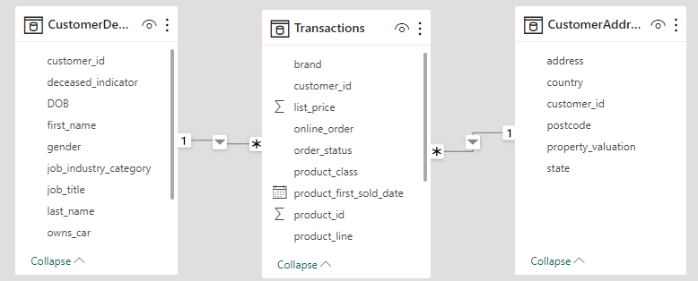
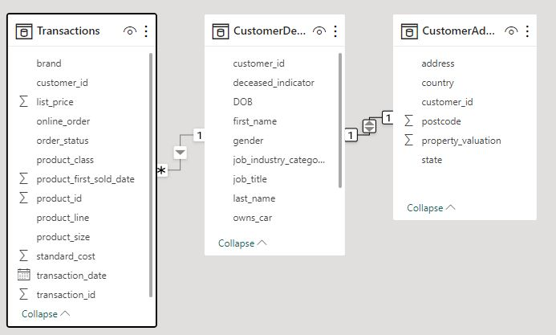
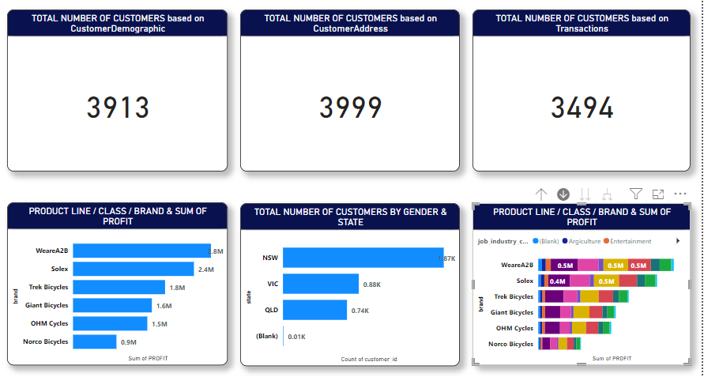

# Sprocket_Central_Pty_Ltd

## Introduction
Dataset provided online from the KPMG Australia internship site through the Forage platform. Dataset provided presented a real-life dataset. A quick preview shows unclean and irrelevant columns, inconsistent data etc. The data exposed me to the concept of Data Quality review and adoption of the Industry Standard Data Quality Dimension (ISDQD) for Data assessment.

## Problem Statement: 
To identify the profitable product of the business and high net worth customers to focus on and the kind of product to possibly push. This would be achieved through the following:
-	Review of Sprocket Central Pty ltd, dataset; identify and resolve data quality issues.
-	Data exploration and model development
-	Visualization and interpretation.

## Skills/Concepts Demonstrated
- Removal of null values.
- Filters
- Changing Data types.
- Modelling
- Removing inconsistencies in datasets e.g. replacing F & Femal with Female etc.

  
## Data Sourcing:
Data provided is excel workbook which was downloaded from the forage site. It contains 4 sheets/tables:
1.	Transactions
2.	NewCustomerlist
3.	CustomerDemographics
4.	CustomerAddress
   
## Data Transformation/Cleaning
Data was cleaned and transformed with the power query editor. Data cleaning dne by adopting the Industry Standard Data Quality Dimensions.

## Data Modelling: 
PowerBI automatically create realtionships but sometimes these relationships may have to be removed or re-created if not meeting purpose e.g. 2 dimension tables automatically connected.
Adjusted Model               |           Auto Model
:---------------------------:|:--------------------------:
           | 

The model is a star schema as depicted above. There are 2-dimensional tables and a transaction table. The dimension tables are all joined to the transaction table with 1-to-many relationships.

## Visualization
The report comprises of 2 pages.
1. Total no of customers with profit generated based on product line/class/gender & state. The page also showed the job industry & their various demands for different brands.
2. Total product on offer

You can interact with the report [here](https://app.powerbi.com/groups/me/reports/d9f5f39f-6f80-4dbb-b8ca-90ce9d5ac050/ReportSection?experience=power-bi)
An image of the report

## Conclusion & Recommendation
### Conclusion
1. Product **class Medium** has the highest profit of $8.6m followed by
2. Product **Line Standard** with the highest profit $8.1m
3. The **Brand WeareA2B** has the highest profit 0f $2.8m follwed by **Solex** $2.4m & **Trek Bike** $1.8m.

4. The State **NSW - New South Wales** has more customers with 1.87K customers which more than double any other state..
5. Also note worthy that there are more female customers than the males and undiclosed.
6. The customers' from the following job industry contributed more to sales of the brand with highest profit:
7.  1. Financial services
    2. Manufacturing
    3. N/A
    4. Health
  
# Recommendation
A further review of job industry 'N/A' will be necessary to have a focussed marketing effort on customers of particular job industry. Also, the discrepancy in the number of customers in the Customer Address & Customer Demographic tables to be resolved with a view to a timely update of tables as required.
An articulate review of the Product line, Product class & brand generating the highest profts should be undertaken to develop a marketing strtaegy that will target customers' appropriately.
